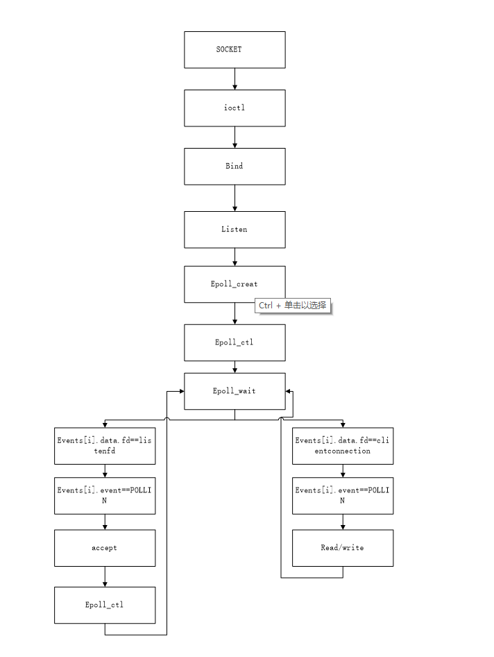

# epoll原理简介
1. 通过创建一个epollfdl来监听一个事件链表
2. 通过控制epfd添加修改或删除事件
3. 通过等待函数来处理两种(监听句柄和客户链接句柄)返回的状态来处理相应的响应

# 原理图


# 核心函数
```c
    int epoll_create(int size);//创建一个大小为size的epfd
    //操作epfd,传入操作码,监听句柄,事件链表
    int epoll_ctl(int epfd, int op, int fd, struct epoll_event *event);
    op:
    	EPOLL_CTL_ADD//添加事件
    	EPOLL_CTL_MOD//修改事件
    	EPOLL_CTL_DEL//删除事件
    //等待epfd返回,设置最大事件和最大时间
    int epoll_wait(int epfd, struct epoll_event *events,int maxevents, int timeout);
```

# demo 添加一个事件
```c
    struct epoll_event event
    event.events =EPOLLIN | EPOLLPRI;
    event.data.fd  = listenfd
    epoll_ctl(epfd,EPOLL_CTL_ADD,listenfd,&event)
```


​	